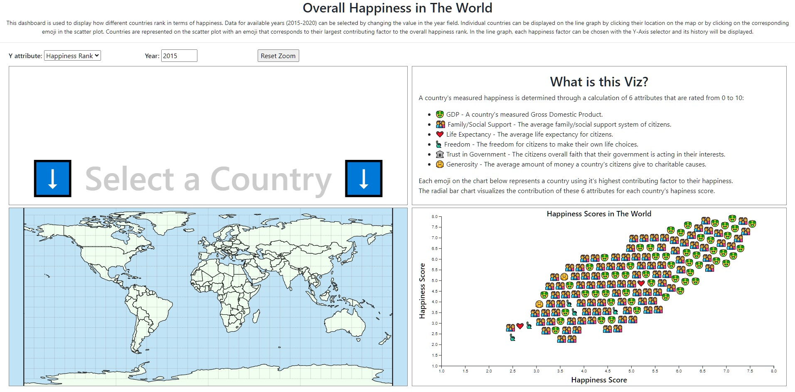
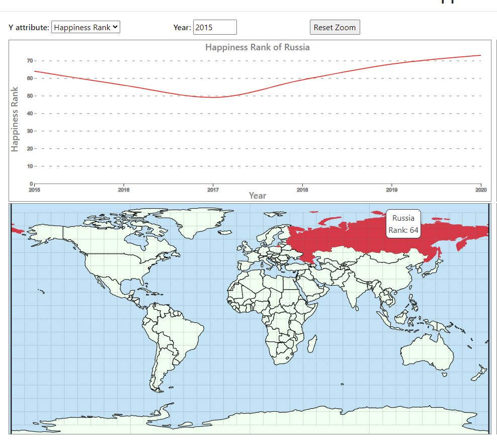
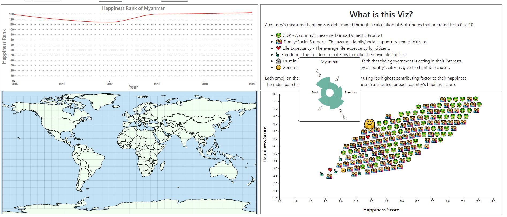

# Overall Happiness In The World Visualization

## Overview:
* This dashboard shows multiple visualizations for the world happiness datasets. Our goal was to show how different attributes affect happiness across the world. We do this by showing the change in these attributes over time with a line graph. The line graph can be controlled by clicking on the world map or the points on the scatterplot. We show rank using a world map with tooltips. We then show the overall happiness score with a scatterplot that has a tooltip that shows a circular bar plot with all the attributes that make up the score. Each point is an emoji representing the most important attribute for the selected year and country. This way our audience can easily identify what the most important attribute that make a country happy. 

## Data description:
* The users for this project will be the general population, and anyone interested in seeing how citizens in other countries rate their happiness.
* We are using a dataset for world happiness from 2015-2020. The world happiness dataset contains the happiness rank and overall score as well as the individual scores for GDP, family size, life expectancy, freedom and trust. Happiness rank is a unique number given to countries based on their overall score. Overall score is a composite score that is a composite of GDP, family size,life expectancy, freedom, and trust. Each of those values are how much the respective category contributes to the overall score. We do not need to preprocess the data further.
  
* the following is a link to our data set
[Link to Data](https://www.kaggle.com/mathurinache/world-happiness-report)

* The only data wrangling we did was using d3 to access the different values in the columns of our dataset.

## Goals and Tasks:

* The main tasks for our users was to understand what attributes make a specific country happy and to understand how those attributes change over time.
* Here are a couple specifc questions our project can help our users with.
  * Where does my country rank in the overall happiness scale?
  * How does that compare to other countries?
  * How does the happiness score compare to prior years?
  * How does health affect happiness for each country?

## Idioms:

* The Interface has 4 places where you can interact with the graphs. The first and most obvious is the world map. Clicking on a country on the world map will change the line graph to that country. The other way to change the line graph is by clicking on the points on the scatter plot. This allows our users to see how specific data changed on the whole. The two other ways to interact with out visualization is the two drop down menus at the top. The attributes menu changes the displayed attribute on the line graph. The year menu changes the displayed year on the scatterplot. 
* We built a world map that displays happiness rank, a scatterplot that has a tooltip that displays all the attributes as a barplot, and a linegraph that shows each individual attributes change over time. this combined allows users to get a big picture of what makes countries happy and how that has changed over time. 
* the world map lets you change the country on the linegraph by clicking on the country. it also has a zoom functionailty. The map will also display the happiness ranking when you hover over a country.
* the linegraph show the change overtime of each attribute for each country. the country can be selected by the world map or the scatterplot. The attribute can be selected by the drop down menu at the top.

* The scatterplot shows the overall happiness score of each country. It then shows the attributes that contribute to that score with a tooltip that displays the attributes as a circular barplot. the points of the scatterplot are also emojis that represent which attribute contributes to the happiness score the most. You can click on the points to change the line graph. This graph is controlled with the year drop down menu at the top. 

